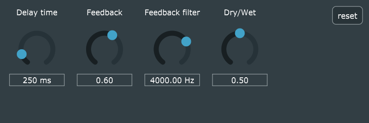

# juce-vst
VST plugins created with JUCE

Delay: basic delay effect created using circular buffer method. With delay time, feedback and dry/wet controls.

StateVariableFilter: basic state variable filter created using StateVariableFilter::Filter class in JUCE dsp module. With possibility to switch between low, band and high pass filter type.

